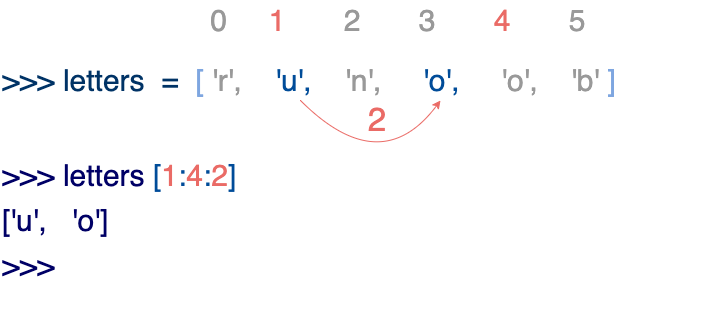

# 环境搭建

## 环境变量

pythonPath、pythonStartup、pythonCaseOK、pythonHome

| 变量名        | 描述                                                         |
| :------------ | ------------------------------------------------------------ |
| PYTHONPATH    | PYTHONPATH是Python搜索路径，**默认**我们import的模块都会从PYTHONPATH里面寻找。 |
| PYTHONSTARTUP | Python启动后，先寻找PYTHONSTARTUP环境变量，然后执行此变量指定的文件中的代码。 |
| PYTHONCASEOK  | 加入PYTHONCASEOK的环境变量, 就会使python导入模块的时候不区分大小写. |
| PYTHONHOME    | 另一种模块搜索路径。它通常内嵌于的PYTHONSTARTUP或PYTHONPATH目录中，使得两个模块库更容易切换。 |

# python3 基础语法

默认使用UTF-8编码，所有字符串都是Unicode字符串，但可以在源文件指定编码：

```python
# _*_ coding: cp-1252 _*_
```

**标识符对大小写敏感**

## 注释

Python中单行注释以 **#** 开头，多行注释可以用多个 **#** 号，还有 **'''** 和 **"""**

```python
# 第一个注释
# 第二个注释
 
'''
第三注释
第四注释
'''
 
"""
第五注释
第六注释
"""
```

## 行和缩进

python使用缩进来表示代码块，不需要使用大括号 **{}** ，也不需要使用分号表示语句结束。*如果需要在同一行写多条语句，则用分号```;```隔开*。

**缩进的空格数是可变的**，但是同一个代码块的语句必须包含**相同的缩进空格**数。

## 多行语句

Python 通常是一行写完一条语句，但如果语句很长，我们可以使用反斜杠 **\** 来实现多行语句，例如：

```python
total = item_one + \
        item_two + \
        item_three
```

在 [], {}, 或 () 中的多行语句，**不需要**使用反斜杠  \，例如：

```python
total = ['item_one', 'item_two', 'item_three',
        'item_four', 'item_five']
```

## 多个语句构成代码组

缩进相同的一组语句构成一个代码块，我们称之代码组。

像if、while、def和class这样的复合语句，首行以**关键字开始，以冒号( : )结束**，该行之后的一行或多行代码构成代码组。

我们将首行及后面的代码组称为一个**子句(clause)**。

```python
if expression : 
   suite
elif expression : 
   suite 
else : 
   suite
```


## 数字(Number)类型

python中数字有四种类型：整数、布尔型、浮点数和复数。

- **int** (整数), 如 1, 只有一种整数类型 int，表示为长整型，<u>没有 python2 中的 Long</u>。
- **bool** (布尔), 如 True。
- **float** (浮点数), 如 1.23、3E-2                                                                                                                                                                                                                                                                                                                                                                                                                                                                                                                                                                                                                                                                                                                                                                                                                                                                                                                                                                                                                                                                                                                                                                                                                                                                                                                                                                                                                                                                                                                                                                                                                                                                                                                                                                                                                                                                                                                                                                                                                                                                                                                                                                                                                                                                                                     
- **complex** (复数), 如 1 + 2j、 1.1 + 2.2j

## <span id="String">字符串(String)</span>

- python中**单引号 和 双引号 使用完全相同**。
- 使用三引号(**'''** 或 **"""**)可以指定一个<u>多行字符串(会保留文本的格式，包括空格)</u>(**多行注释也是这个原理**)。
- 转义符 **\ **转义特殊字符，也可以是作为续行符。
- 反斜杠可以用来转义，使用 ```r``` 可以让反斜杠不发生转义。 如``` r"this is a line with \n" ```则\n会显示，并不是换行。**这里的 r 指 raw，即 raw string**，会自动将反斜杠转义。
- 按字面意义级联字符串，如"this " "is " "string"会被自动转换为this is string。
- 字符串可以用 **+ 运算**符连接在一起，用 *** 运算**符重复。
- Python 中的字符串有两种**索引**方式，<u>从左往右以 0 开始，从右往左以 -1 开始</u>。
- **Python中的字符串不能改变。**
- Python 没有单独的字符类型（即没有Java里的char类型，只有String类型），一个字符就是长度为 1 的字符串。
- 字符串的截取的语法格式如下：```变量[头下标:尾下标:步长]``` 截取区间是**[下标的值 ，尾下标的值）**左闭右开

```python
#!/usr/bin/python3
 
str='123456789'
 
print(str)                 # 输出字符串
print(str[0:-1])           # 输出第一个到倒数第二个的所有字符
print(str[0])              # 输出字符串第一个字符
print(str[2:5])            # 输出从第三个开始到第五个的字符
print(str[2:])             # 输出从第三个开始后的所有字符
print(str[1:5:2])          # 输出从第二个开始到第五个且每隔一个的字符（步长为2）
print(str * 2)             # 输出字符串两次
print(str + '你好')         # 连接字符串
 
print('------------------------------')
 
print('hello\nrunoob')      # 使用反斜杠(\)+n转义特殊字符
print(r'hello\nrunoob')     # 在字符串前面添加一个 r，表示原始字符串，不会发生转义

str = "这是第一行" + \
      "这是第二行"
print(str)
```

## 空行

空行不会影响解释器的运行，但是为了代码简洁易于维护。通常在函数之间或类的方法之间用空行分隔，表示一段新的代码的开始。类和函数入口之间也用一行空行分隔，以突出函数入口的开始。

## 导入模块

在 python 用``` import ```或者 ```from...import``` 来导入相应的模块。

将整个模块(somemodule)导入，格式为： ```import somemodule```

从某个模块中导入**某个函数**,格式为：```from somemodule import somefunction```

从某个**模块中**导入**多个函数**,格式为：```from somemodule import firstfunc, secondfunc, thirdfunc```

将某个模块中的全部函数导入，格式为： ```from somemodule import *```

# python3 基本数据类型

python中变量赋值后直接可以使用，使用前必须赋值，这样才知道变量指向的是什么类型数据。

```python
a = b = c =	1

a,b,c = 1,2,"three"  # 相当于a=1;b=2;c="three"
```

**标准数据类型：**

* Number（数字）
* String（字符串）
* List（列表）
* Tuple（元组）
* Set（集合）
* Dictionary（字典）

## Number（数字）

* int

  > python3中整数只有int，取消了python2中的Long类型

* float

* bool

  > 布尔类型在python中是数字类型，所以**可以进行数字计算**。*而在java中为单独一类，不可计算*。
  
   python3中，bool是int的子类型，True== 1 ,False==0 但是可以使用 ```is```来判断
  
   ```python
   >>> 1 == True
   True
   >>> 1 is True
   False
   >>> 0 == False
   True
   >>> 0 is False
   False
   ```

* complex(复数)

 > 使用内置函数 ```type() 或 isinstance(a,int)```可以查看变量所指的对象类型。
 >
 > type()不会认为子类是一种父类类型。
 >
 > isinstance()会认为子类是一种父类类型   

 > 使用 ```del``` 语句删除变量，其实，实际上就是<u>删除变量**及**与对象之间的引用</u>，让变量失效。
 >
 > ```python
 > del var
 > del va1, var2   # 删除多个变量
 > ```

> > 数值的**除法**包含两个运算符：**/** 返回一个**浮点数**，**//** 返回一个**整数**
> >
> > 在混合计算时，Python会把整型**转换成为浮点**数。

## [String(字符串)](#String)

## List（列表）

列表中元素的==**类型可以不相同**==，它支持数字，字符串甚至可以包含列表。

> java中数组类型，只能放相同类型的对象
>
> ```java
> // Java中声明一个Dog数组，数组长度为10.
> Dog[] a = new Dog[10];
> ```

列表使用```[]```中括号定义，元素之间使用逗号分隔。索引值从 0 开始，-1表示从末尾开始的位置。

与字符串（String）类型**相似**，列表使用：加号 **+** 是列表连接运算符，星号 ***** 是重复操作，同时和字符串一样，list可以被索引和切片，**切片时**依然可以接收第三个参数（**步长**）。

```python
>>> list = [ 'abcd', 786 , 2.23, 'runoob', 70.2 ];tinylist = [123, 'runoob']
>>> print (list + tinylist)
['abcd', 786, 2.23, 'runoob', 70.2, 123, 'runoob']
>>> add = list + tinylist
>>> print(add)
['abcd', 786, 2.23, 'runoob', 70.2, 123, 'runoob']
>>> type(add)
<class 'list'>
>>> 
```

与Python字符串不一样的是，**列表中的元素是可以改变**的，可以直接根据索引值赋值。

```python
>>> a = [1, 2, 3, 4, 5, 6]
>>> a[0] = 9
>>> a[2:5] = [13, 14, 15]
>>> a
[9, 2, 13, 14, 15, 6]
>>> a[2:5] = []   # 将对应的元素值设置为 []
>>> a
[9, 2, 6]
```


> List进行切片时，使用步长参数举例。
>
> 当第三个参数为负数时，表示逆向读取（字符串同）。



## Tuple（元组）

元组（tuple）与列表类似，不同之处在于**元组的元素==不能修改==** *（List可以使用```del```删除元素，而Tuple不允许操作元素。两者相当于java中数组与可变数组的关系）*。元组写在小括号``` () ```里，元素之间用逗号隔开。元组中的元素类型也可以不相同。字符串可以视为一种特殊的元组。

> string、list 和 tuple 都属于 sequence（序列）。

**特殊语法**：

```python
tup1 = ()    # 空元组
tup2 = (20,) # 一个元素，需要在元素后添加逗号（python3中已经不需要逗号）
```

## Set（集合）


## Dictionary（字典）
